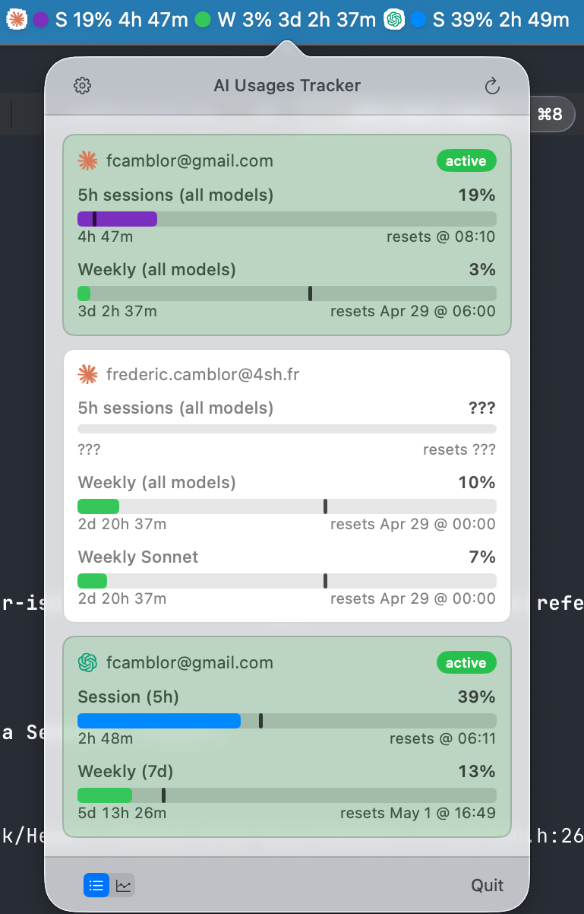
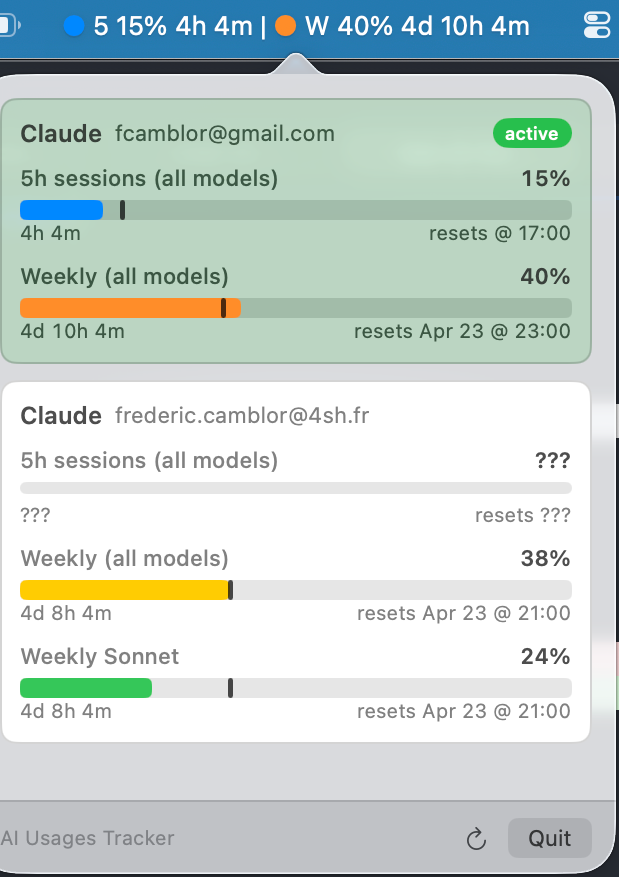
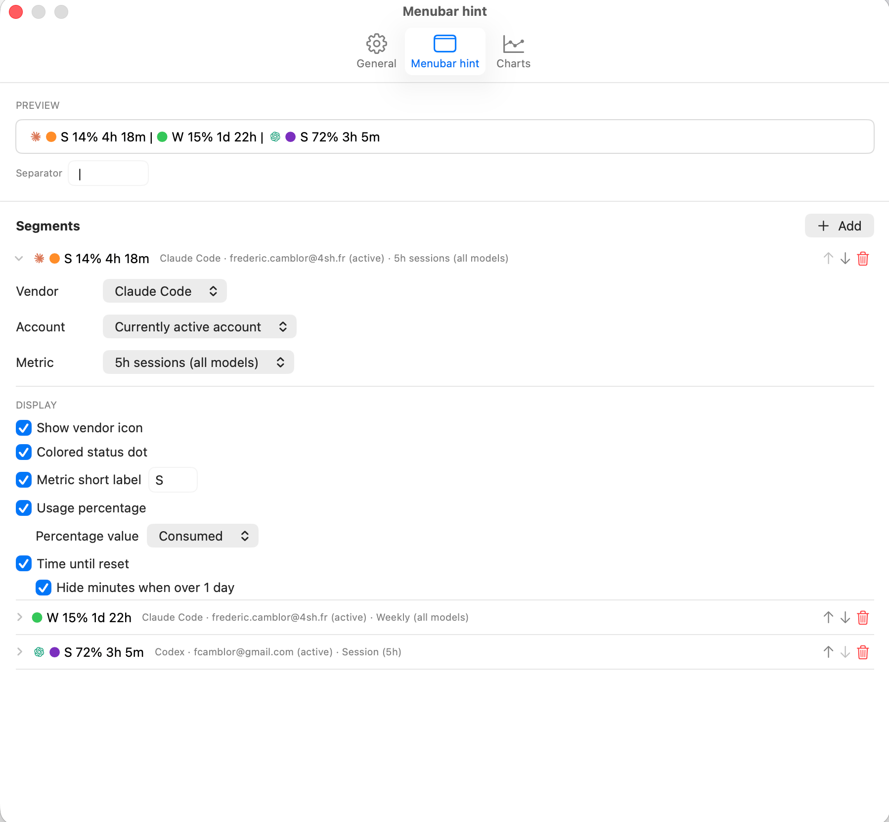
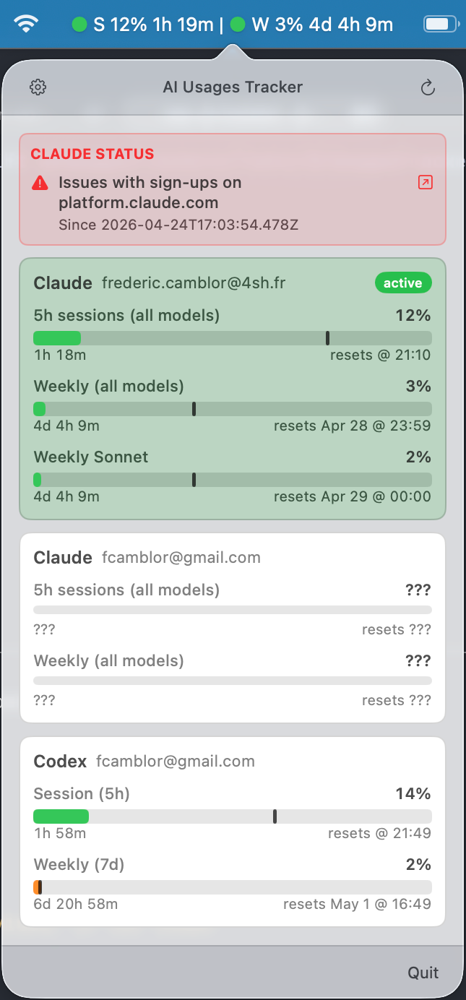
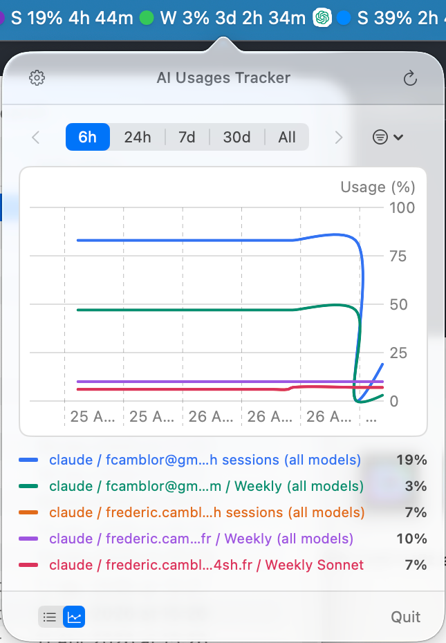

# AI Usages Tracker

AI Usages Tracker is a macOS menu bar app for monitoring AI assistant usage limits and account status. It keeps current usage visible at a glance, highlights the active local account, records usage history, and surfaces vendor status issues that may affect usage fetching.

The project aims to provide:

- Menu bar usage tracking for supported assistants.
- Active-account monitoring from each assistant's local configuration.
- Usage history charts for recent consumption trends.
- Vendor status and outage visibility in the app popover.
- Configurable refresh behavior for automatic polling.

## Installation

Install with Homebrew:

```sh
brew tap fcamblor/tap
brew install --cask ai-usages-tracker
```

## First Launch

On a fresh install, the menu bar shows a **Configure AI Metrics** call to action — no segments are pre-seeded so the app does not assume which assistant or metrics matter to you.


Click the menu bar item to open the popover, then **Open Settings** to add your first segment (vendor, account, metric, display options). Once at least one segment is configured, the menu bar label switches to live usage data.

## Screenshots & Features

### Multi-account support

Monitor multiple AI assistant accounts side by side. The active account is highlighted so the currently billed usage is always visible at a glance.



### Color-coded usage gauges

Each usage bar changes color as consumption approaches the limit, making it easy to spot which metric needs attention without reading numbers.



### Customizable menu bar display

Configure which segments appear in the menu bar label — vendor icon, colored status dot, metric short label, usage percentage, and time until reset — and choose the separator between them.



### Vendor status alerts

When an assistant vendor reports an incident, a status banner appears at the top of the popover so usage anomalies can be attributed to known outages.



### Usage history charts

Switch to the chart view to see consumption trends over the past 6 hours, 24 hours, 7 days, 30 days, or the full recorded history.



## Supported Assistants

### Claude Code

AI Usages Tracker reads the active Claude Code account from `~/.claude.json` and retrieves OAuth credentials from the macOS Keychain service `Claude Code-credentials`.

### Codex

AI Usages Tracker reads Codex auth from the first available source:

- `CODEX_HOME/auth.json`
- `~/.config/codex/auth.json`
- `~/.codex/auth.json`
- macOS Keychain service `Codex Auth`

## Data Locations

AI Usages Tracker keeps its runtime data under the current user's home directory.

### Cache and Logs

The app-owned cache directory is:

```text
~/.cache/ai-usages-tracker/
```

It contains:

- `usages.json`: latest usage snapshot used by the menu bar UI.
- `usages.json.lock`: advisory lock file used to coordinate safe reads and writes.
- `usage-history/YYYY/MM/YYYY-MM-DD.jsonl`: append-only daily usage-history snapshots, grouped by UTC date.
- `app.log`: app lifecycle, polling, persistence, and UI-adjacent logs.
- `claude-usages-connector.log`: Claude Code connector and status-fetch logs.
- `codex-usages-connector.log`: Codex connector and status-fetch logs.
- `*.log.1`: rotated log backups. Each managed log rotates after 5 MB.

Deleting the cache directory resets local usage snapshots, history, and logs. It does not remove assistant credentials or macOS user preferences.

### User Preferences

Preferences are stored with macOS `UserDefaults.standard`. For the bundled app, the expected preferences file is:

```text
~/Library/Preferences/io.github.fcamblor.ai-usages-tracker.plist
```

The app stores these preference keys:

- `ai-tracker.refreshIntervalSeconds`: automatic refresh interval.
- `ai-tracker.launchAtLogin`: launch-at-login preference mirrored from the system login item state.
- `ai-tracker.logLevel`: selected log verbosity.
- `ai-tracker.menuBarSegments`: configured menu bar label segments.
- `ai-tracker.menuBarSegmentsInitialized`: internal flag that prevents reseeding segments after the user edits them.
- `ai-tracker.menuBarSeparator`: separator inserted between menu bar label segments.

Assistant OAuth credentials are not stored in this preferences file. They are read from the assistant-specific files and Keychain services listed above.

## Color Display

Colors are used as status signals, not as persisted data. They are computed at render time from usage metrics, vendor branding, or incident severity.

### Usage Severity Colors

Time-window metrics are compared against their theoretical pace for the current window:

```text
consumption ratio = actual usage percent / expected usage percent at this point in the window
```

That ratio drives the colored status dot in the menu bar and the gauge fill color in the popover:

| Tier | Ratio | Color |
| --- | ---: | --- |
| Comfortable | `< 0.7` | system green |
| On track | `0.7 - 0.9` | system blue |
| Approaching | `0.9 - 1.0` | system yellow |
| Over pace | `1.0 - 1.2` | system orange |
| Critical | `1.2 - 1.6` | system red |
| Exhausted | `>= 1.6` | purple `#7B2FBE` |

Pay-as-you-go metrics, such as Codex credits, render as plain text without a severity dot.

## Build From Source

Requirements:

- macOS 14 or later.
- Swift 6 toolchain or Xcode command line tools.
- Homebrew, if installing the distributed cask.

Build and launch the app bundle from the repository root:

```sh
./scripts/build-app-bundle.sh
open "dist/AI Usages Tracker.app"
```

## Development

Run development commands from `AIUsagesTrackers/`, the Swift package root:

```sh
swift build
swift run AIUsagesTrackers
swift test
swift package clean
```

Additional project notes:

- [Development guide](docs/DEVELOPMENT.md)
- [Architecture overview](docs/ARCHITECTURE.md)
