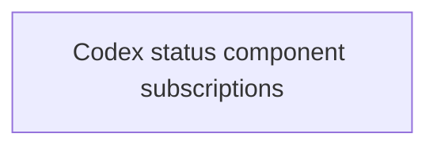

# Roadmap

Open epics for the app. This file is the single source of truth for the features still to implement and their inter-dependencies. Completed features are removed from this index and their files deleted.

Status values: `planned` | `in-progress`.

See `docs/ROADMAP.md` for the process and file conventions.

## Dependency graph

## Epics

1. `planned` — [Codex status component subscriptions](codex-status-component-subscriptions.md) — filter OpenAI status incidents to only those affecting subscribed Codex child components, with a preferences tab to manage the subscription list.
