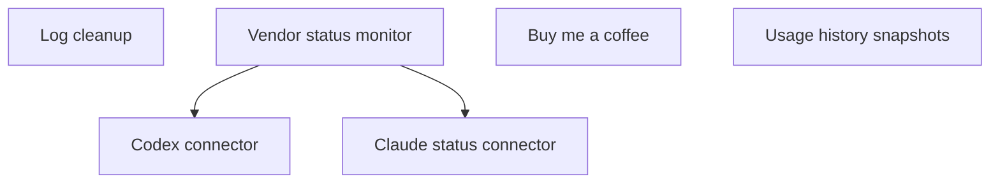

# Roadmap

Open epics for the app. This file is the single source of truth for the features still to implement and their inter-dependencies. Completed features are removed from this index and their files deleted.

Status values: `planned` | `in-progress`.

See `docs/ROADMAP.md` for the process and file conventions.

## Dependency graph

## Epics

1. `in-progress` — [Log cleanup](log-cleanup.md) — purge log entries older than 7 days at startup and once per day to keep log files bounded.
2. `in-progress` — [Vendor status monitor](vendor-status-monitor.md) — surface active incidents from vendor status pages (Claude, and others as accounts are added) inside the app.
3. `planned` — [Claude status connector](claude-status-connector.md) — fetch Claude incident data in-app so outages refresh without an external writer and share the global refresh button.
4. `planned` — [Buy me a coffee](buy-me-a-coffee.md) — add a discreet donation button in the popover footer that opens the developer's donation page in the browser.
5. `planned` — [Codex connector](codex-connector.md) — add OpenAI Codex CLI as a second tracked vendor alongside Claude.
6. `planned` — [Usage history snapshots](usage-history-snapshots.md) — periodically record metric values to a JSONL file for future consumption graph views.
