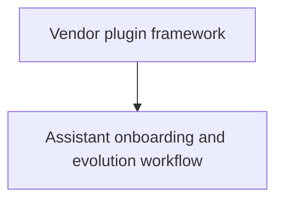

# Roadmap

Open epics for the app. This file is the single source of truth for the features still to implement and their inter-dependencies. Completed features are removed from this index and their files deleted.

Status values: `planned` | `in-progress`.

See `docs/ROADMAP.md` for the process and file conventions.

## Dependency graph

## Epics

1. `planned` — [Vendor plugin framework](vendor-plugin-framework.md) — define a contract-based plugin framework so adding a new AI assistant follows a single, well-documented pattern across auth, usage fetching, persistence, branding, status, and account monitoring.
2. `planned` — [Assistant onboarding and evolution workflow](new-assistant-onboarding-workflow.md) — formalize the LLM-guided implementation, PR review, nightly-build attachment, tester validation, and merge gate for shipping any vendor-scoped change (new assistants and evolutions of existing ones, including backward-incompatible refactors and urgent fixes).
